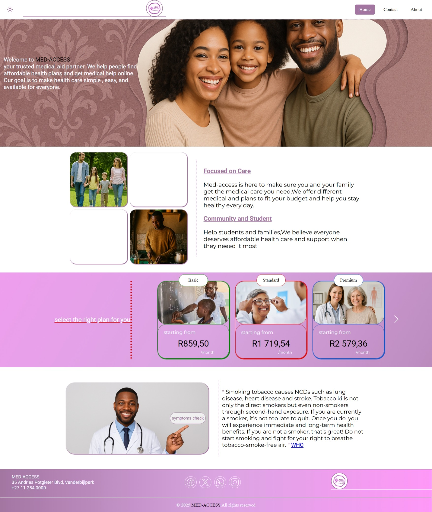
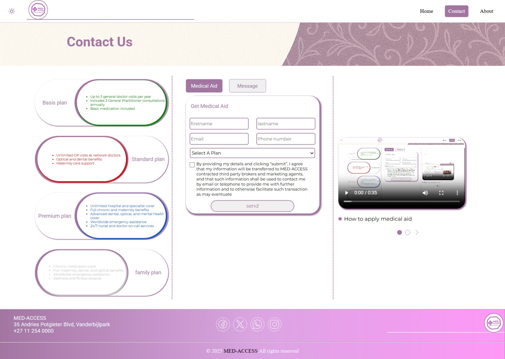
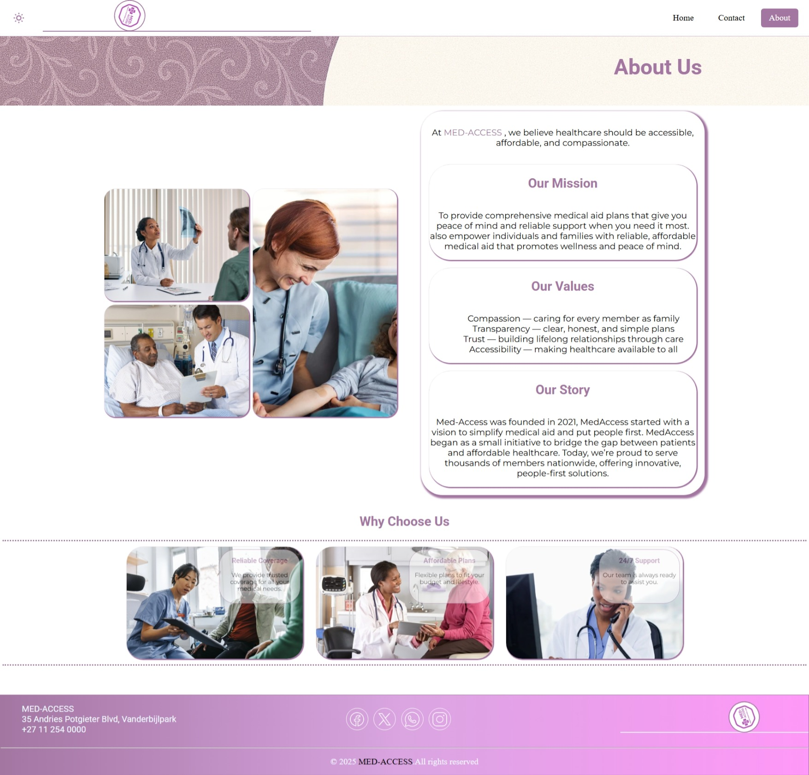

# 🏥 Med-Access

**Med-Access** is an interactive website that allows users to **apply for medical aid** and **check possible diseases** based on selected symptoms.  
The project focuses on improving access to basic healthcare information through a simple and user-friendly web interface.

---

## 🚀 Live Demo

🔗 https://washuravele.github.io/med-access

---


## 🌟 Features

- 📝 **Medical Aid Application** – Users can apply for medical aid through an online form  
- 🩺 **Symptom Checker** – Select symptoms and view possible diseases  
- 🎨 **Responsive UI** – Clean and easy-to-use design  
- ⚙️ **Backend Processing** – PHP used for form handling and logic  

---

## 🛠️ Technologies Used

- **HTML5**
- **CSS3**
- **JavaScript**
- **PHP**

---

## 📸 Screenshots

> Screenshots of the application interface.
### Home page


### Symptom Checker


### Contact Page


### About Us Page


---

## 📂 Project Structure

```
med-access/
├─ css/
├─ images/    
├─ js/
├─ php/  
├─ screenshots/       
├─ vidoes/            
├─ about.html
├─ contact.html
├─ index.html
├─ README.md

```
---

## 👨‍💻 Author

**Washu Ravele**
Aspiring Software Developer

* GitHub: [https://github.com/washuravele](https://github.com/washuravele)

---

## 📄 License

This project is for educational and portfolio purposes.


